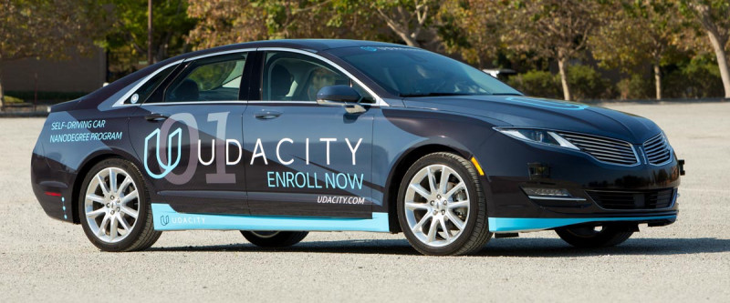
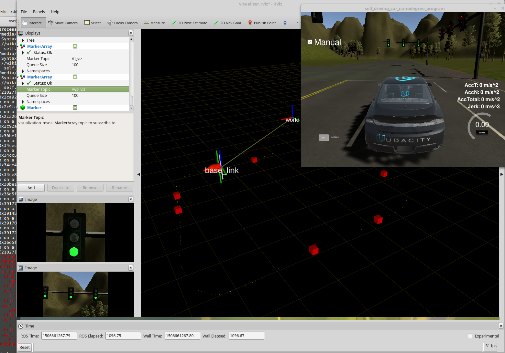
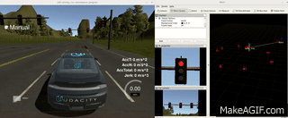
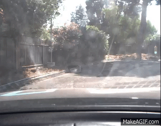

# Self-Driving Car Nanodegree Capstone Project (CAR-X Team)

### Overview

The System Integration project is the final project of the Udacity Self-Driving Car Engineer Nanodegree.

The goal of this project is to code a real self-driving car to drive itself on a test track using [ROS](http://www.ros.org/) and [Autoware](https://github.com/CPFL/Autoware). The project is coded to run on Udacity simulator as well as on Udacity's own self-driving car [CARLA](https://medium.com/udacity/how-the-udacity-self-driving-car-works-575365270a40).



As a team, we built ROS nodes to implement core functionality of the autonomous vehicle system, including traffic light detection, control, and waypoint following.

For more information about the project, see the project introduction [here](https://classroom.udacity.com/nanodegrees/nd013/parts/6047fe34-d93c-4f50-8336-b70ef10cb4b2/modules/e1a23b06-329a-4684-a717-ad476f0d8dff/lessons/462c933d-9f24-42d3-8bdc-a08a5fc866e4/concepts/5ab4b122-83e6-436d-850f-9f4d26627fd9).

### Architecture

Using the Robot Operating System (ROS), each team member has developed and maintained a core component of the infrastructure that is demanded by the autonomous vehicle. The three core components of any good robot are the following:

- Perception: Sensing the environment to perceive obstacles, traffic hazards as well as traffic lights and road signs.

- Planning: Route planning to a given goal state using data from localization, perception and environment maps.

- Control: Actualising trajectories formed as part of planning, in order actuate the vehicle, through steering, throttle and brake commands.


### ROS Nodes Description


#### Waypoint Updater node (**waypoint_updater**)

This node publishes the next **200** waypoints that are closest to vehicle's current location and are ahead of the vehicle. This node also considers obstacles and traffic lights to set the velocity for each waypoint.

This node subscribes to following topics:

	- **base_waypoints**: Waypoints for the whole track are published to this topic. This publication is a one-time only operation. The waypoint updater node receives these waypoints, stores them for later use and uses these points to extract the next 200 points ahead of the vehicle.

	- **traffic_waypoint**: To receive the index of the waypoint in the base_waypoints list, which is closest to the red traffic light so that the vehicle can be stopped. The waypoint updater node uses this index to calculate the distance from the vehicle to the traffic light if the traffic light is red and the car needs to be stopped.

	- **current_pose**: To receive current position of vehicle.


The functionality of the `waypoint updater` node is to process the track waypoints that are provided from the `waypoint_loader` and provide the next waypoints that the car will follow. The speed is adjusted in the presence of a red traffic light ahead.

For the described operation the following steps are followed, provided that the track waypoints have already been loaded:

	- __Identify the car's position in the car__ (`pose_cb`) :
	Knowing the car's position in (x,y) coordinates, the closent track point is returned as an index ranked by its Euclidean distance.  Then the next few points ahead (defined by LOOKAHEAD_WPS constant) will be the final uprocessed waypoints.

	-  __Processing of the waypoints__ (`waypoints_process`):
	The functions loops throught the subsequent waypoints and the following options can take plance.
		- __Traffic light not close or green:__ The waypoints velocity is updated with the maximum allowed one
		- __Traffic light red and close__: The car is required to stop. The velocity is set to 0
		- __Traffic light red within deceleration distance__: Car is approaching the traffic light but is not so close yet. Velocity is linearly dropping.

After the waypoints are updated they are published and are send through the waypoint follower to the `twist controller` which is implementing the actuator commands.
This node publishes to following topics:

	- **final_waypoints**: Selected 200 waypoints including their velocity information are published to this topic.


#### Twist Controller Node **(dbw_node)**

This node is responsible for vehicle control (acceleration, steering, brake).

This node subscribes to the following topics:

	- **dbw_enabled**: Indicates if the car is under dbw or driver control.
	- **current_velocity**: To receive the current velocity of the vehicle.
	- **twist_cmd**: Target vehicle linear and angular velocities in the form of twist commands are published to this topic.

This node publishes to following topics:

	- **steering_cmd**: Steering commands are published to this topic.
	- **throttle_cmd**: Throttle commands are published to this topic.
	- **brake_cmd**: Brake commands are published to this topic.

To calculate vehicle control commands for steering, throttle and brake this node makes use of Controller (as coded in twist_controller.py).
	
The throttle of the car is calculated based on the current velocity and the target velocity and controlled by a PID controller for error correction. The PID controller uses the following parameters.

	```
	 kp   = 0.3
	 ki   = 0.003
	 kd   = 4.0
	```
The parameters may need to be tweaked in real world situation as the current settings were for the simulator.

The `Yaw Controller` controls the steering angle based on the current linear velocity and the target linear and angular velocity.

The brake value is based on multiple parameters, viz. the mass of the vehicle, current velocity of the car and the radius of the wheel. The deceleration is limited by the parameter 'decel_limit'.  Brake is applied only if the target velocity is less than the current velocity. The brake value is in N/m and the formulae used for calculting the brake is as follows.

	```
	longitudinal_force = mass_of_car * acceleration (or deceleration)
	    
	Torque needed to stop/ accelerate = longitudinal_force * wheel_radius
	    
	```
 
The torque is supplied as the brake value in N/m limited by the decel_limit parameter.

Further refinements possible by adding the weight of fuel and the passengers to the mass of the vehicle while calculating the longitudinal force.
    
#### Traffic light detection node **(tl_detector)**

The closest waypoint is found using shortest distance criteria. After the nearest TL is found, it is checked if we passed it by looking at the angle between the car's heading vector and a vector pointing from the car the TL location. The angle is found from the scalar product of these two vectors. If this angle is greater than pi/2, the stop-line is considered to be passed and the corresponding stop-line waypoint is not published anymore.

	```python
	# let's use scalar product to find the angle between the car orientation vector and car/base_point vector
    car_orientation = p_q * PyKDL.Vector(1.0, 0.0, 0.0)
    wp_vector       = PyKDL.Vector(wpt.pose.pose.position.x-pose.position.x,
                            wpt.pose.pose.position.y-pose.position.y, 0.0)

    cos_angle = PyKDL.dot(car_orientation, wp_vector)/car_orientation.Norm()/wp_vector.Norm()
    angle     = np.arccos(cos_angle)

    if direction == 'F':
        if angle < np.pi/2.0:
            best_distance = distance
            best_angle = angle
            best_i = i
    if direction == 'R':
        if angle > np.pi/2.0:
            best_distance = distance
            best_angle = angle
            best_i = i
	```

The projection was done in 2 stages:
	
	- Changing the TL coordinate system from global to car's local one:

		```python
	   piw = PyKDL.Vector(point_in_world.x,point_in_world.y,point_in_world.z)
	   R = PyKDL.Rotation.Quaternion(*rot)
	   T = PyKDL.Vector(*trans)
	   p_car = R*piw+T
		```

	- Using a pinhole camera model to project the TL location onto the image plain.

		```python
        f = 2300
        x_offset = -30
        y_offset = 340
        fx = f
        fy = f

        x = -p_car[1]/p_car[0]*fx+image_width/2 + x_offset
        y = -p_car[2]/p_car[0]*fx+image_height/2+y_offset

        return (int(x), int(y))
		```
The focal distance and offset pinhole model parameters were tuned to match the TL with its image. For the tuning, the pinhole project properties were utilized: the offsets were selected to match the TL coordinate to its image when the car was far away from the TL and the focal length was tuned for closer TL positions.

Finally, the image is cropped around the found TF projection to simplify the classification task.

#### TLClassifier class **(tl_classifier)**

Knowing the coordinates of the traffic light in the world coordinate system together with accurate transformation for the car coordinate system makes the traffic detection problem trivial. In the project, the classification is done based on the color - the traffic light colors are very saturated what makes it easy to detect the state on the background. In real conditions, a more intelligent classifier should be used (e.g. a neural network similar to YOLO or SSD, or a fully convolutional network)
	
	```python
        hsv_img = cv2.cvtColor(image,cv2.COLOR_BGR2HSV)
        #red
        RED_MIN = np.array([0, 120, 120],np.uint8)
        RED_MAX = np.array([10, 255, 255],np.uint8)
        frame_threshed = cv2.inRange(hsv_img, RED_MIN, RED_MAX)
        r = cv2.countNonZero(frame_threshed)
        if r > 50:
            return TrafficLight.RED

        YELLOW_MIN = np.array([40.0/360*255, 120, 120],np.uint8)
        YELLOW_MAX = np.array([66.0/360*255, 255, 255],np.uint8)
        frame_threshed = cv2.inRange(hsv_img, YELLOW_MIN, YELLOW_MAX)
        y = cv2.countNonZero(frame_threshed)
        if y > 50:
            return TrafficLight.YELLOW

        GREEN_MIN = np.array([90.0/360*255, 120, 120],np.uint8)
        GREEN_MAX = np.array([140.0/360*255, 255, 255],np.uint8)
        frame_threshed = cv2.inRange(hsv_img, GREEN_MIN, GREEN_MAX)
        g = cv2.countNonZero(frame_threshed)
        if g > 50:
            return TrafficLight.GREEN

        return TrafficLight.UNKNOWN
	```

### Visualization module

To facilitate debugging of the system a visualization module was created for RVIZ. Information about waypoints, car location, upcoming stop light and also traffic light and their status - red, yellow or green. The screenshot below is an example of RVIZ debugging session:



### Installation

* Be sure that your workstation is running Ubuntu 16.04 Xenial Xerus or Ubuntu 14.04 Trusty Tahir. [Ubuntu downloads can be found here](https://www.ubuntu.com/download/desktop).
* If using a Virtual Machine to install Ubuntu, use the following configuration as minimum:
  * 2 CPU
  * 2 GB system memory
  * 25 GB of free hard drive space

  The Udacity provided virtual machine has ROS and Dataspeed DBW already installed, so you can skip the next two steps if you are using this.

* Follow these instructions to install ROS
  * [ROS Kinetic](http://wiki.ros.org/kinetic/Installation/Ubuntu) if you have Ubuntu 16.04.
  * [ROS Indigo](http://wiki.ros.org/indigo/Installation/Ubuntu) if you have Ubuntu 14.04.
* [Dataspeed DBW](https://bitbucket.org/DataspeedInc/dbw_mkz_ros)
  * Use this option to install the SDK on a workstation that already has ROS installed: [One Line SDK Install (binary)](https://bitbucket.org/DataspeedInc/dbw_mkz_ros/src/81e63fcc335d7b64139d7482017d6a97b405e250/ROS_SETUP.md?fileviewer=file-view-default)
* Download the [Udacity Simulator](https://github.com/udacity/CarND-Capstone/releases/tag/v1.2).

### Usage

1. Clone the project repository

	```bash
	git clone https://github.com/udacity/CarND-Capstone.git
	```

2. Install python dependencies

	```bash
	cd CarND-Capstone
	pip install -r requirements.txt
	```

3. Make and run styx

	```bash
	cd ros
	catkin_make
	source devel/setup.sh
	roslaunch launch/styx.launch
	```

4. Run the simulator

The following link has he video recording of the simulator

Please check out the link below for a video sample of the simulator. 

[](https://youtu.be/rBYisFvp-Hs)

### Running code on CARLA

In the project, the classification is done based on the color - the traffic light colors are very saturated what makes it easy to detect the state on the background. In order to run the code on CARLA, it is necessary to use a different classifier, a more intelligent classifier should be used (e.g. a neural network similar to YOLO or SSD, or a fully convolutional network)


### Collaboration

Each of the team members in `Car-X` team should handle a core component.

Assuming `Eqbal` is handling the `dbw_node`:

- Create a branch with the first two name initiative followed by the node name: `git checkout -b eq-dbw_node`

- Commit the changes: `git commit -am "descriptive but short commit"`

- Once you are stuck push your branch so everyone in the team can check out the updates: `git push -u origin eq-dbw_node`

- For testing please keep your python notebooks inside `./notebooks` folder.

- Don't apply the changes directly to `master`


### Team Members:

  - [Eqbal Quran](www.eqbalq.com) (info@eqbalq.com) - Team Leader/ Project Planner/ Reviewer

  - Jaime Blasco (pinoch0@gmail.com) - Contributed to TL Detection / Full system testing and finetuning

  - Dimitrios Mavridis (dmavridis@gmail.com) - Contributed to Waypoint Updates / Full system testing and finetuning

  - Mani Srinivasan (srnimani@gmail.com) - Contributed to DBW Node

  - Volodymyr Seliuchenko (volodymyr.seliuchenko@gmail.com) - Contributed to TL Detection / Classification / Visualization module

### Real world testing

1. Download [training bag](https://drive.google.com/file/d/0B2_h37bMVw3iYkdJTlRSUlJIamM/view?usp=sharing) that was recorded on the Udacity self-driving car
2. Unzip the file
```bash
unzip traffic_light_bag_files.zip
```
3. Play the bag file
```bash
rosbag play -l traffic_light_bag_files/loop_with_traffic_light.bag
```
4. Launch your project in site mode
```bash
cd CarND-Capstone/ros
roslaunch launch/site.launch
```

A video recording of this run is uploaded on youtube here

[](https://www.youtube.com/watch?v=wEFzopjE1kQ&feature=youtu.be)
